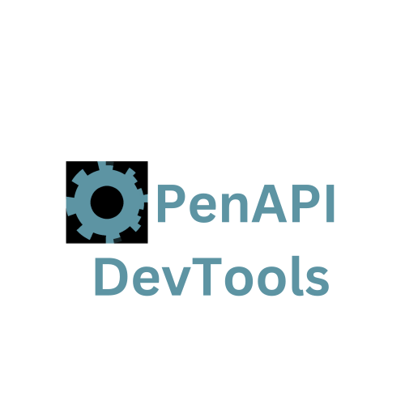

[![MIT License][license-shield]][license-url]
[![Download in the Chrome Web Store][chrome-shield]][chrome-url]

<!-- PROJECT LOGO -->
 

  

  

    Effortlessly discover API behaviour with a Chrome extension that automatically generates OpenAPI specifications in real time for any app or website.
     
     
    <a href="https://github.com/AndrewWalsh/openapi-devtools/issues">Report Bug</a>
    ·
    <a href="https://github.com/AndrewWalsh/openapi-devtools/issues">Request Feature</a>
    ·
    <a href="https://awalsh.io/posts/openapi-devtools/">Read More</a>
  

## About The Project

    

OpenAPI DevTools is a Chrome extension that generates OpenAPI specifications in real time from network requests. Once installed it adds a new tab to Chrome DevTools called `OpenAPI`. While the tool is open it automatically converts network requests into a specification.

*Features*:
- Instantly generate an OpenAPI 3.1 specification for any website or application just by using it
- Automatically merges new request & response headers, bodies, and query parameters per endpoint
- Click on a [path parameter](https://www.abstractapi.com/api-glossary/path-parameters) and the app will automatically merge existing and future matching requests
- View the specification inside the tool using [Redoc](https://www.npmjs.com/package/redoc) and download with a click
- Export and save a session at any time, or share it with others

(<a href="#readme-top">back to top</a>)

## Installation

    

[Download the extension in the Chrome Web Store](https://chrome.google.com/webstore/detail/openapi-devtools/jelghndoknklgabjgaeppjhommkkmdii).

Otherwise, to install manually:
  - [Download and extract the dist.zip file in the latest release](https://github.com/AndrewWalsh/openapi-devtools/releases/latest/download/dist.zip)
  - In Chrome, navigate to `chrome://extensions`
  - In the top right enable the `Developer mode` toggle
  - In the top left click `Load unpacked` and select the extracted `dist` directory
  - Open a new tab and then select `OpenAPI` in the developer tools (open with `cmd+i` or `ctrl+i`)

(<a href="#readme-top">back to top</a>)

## Usage

The specification will automatically populate based on JSON requests that fire as you browse the web. In the settings menu you can filter hosts and parameterise paths in URLs. Once you do so all matching existing and future requests to that endpoint will be merged. This process is irreversible, but you can clear the specification and restart at any time.

When the same endpoint responds with different data, such as a value that is sometimes a string and sometimes null, the specification for that value will be *either* string or null. All information is accounted for in the final specification. If you see something missing from a request, trigger a request that contains the missing information.

The settings menu contains several options. Here you can enable real examples in the specification. You can also export the current state of the app as a string, share or store it, and import it later.

(<a href="#readme-top">back to top</a>)

## What is OpenAPI?

An [OpenAPI](https://www.openapis.org/) specification is a description of what an API expects to receive and what it will respond with. It is governed by the OpenAPI Initiative and the Linux Foundation. OpenAPI specifications are the modern standard for RESTful APIs, and systems that have them are far easier to work with.

(<a href="#readme-top">back to top</a>)

## Contributing

To develop the project:
- `npm install`
- `npm run build`
- Navigate to `chrome://extensions`
- In the top right enable the `Developer mode` toggle
- In the top left click `Load unpacked` and select the `dist` directory
- You should now see the tool in Chrome DevTools. You can interact it with like a regular page, including inspection of the React app
- [Extensions Reloader](https://chrome.google.com/webstore/detail/extensions-reloader/fimgfedafeadlieiabdeeaodndnlbhid) is suggested to update the tool after running `npm run build` and updating the `dist` directory 

(<a href="#readme-top">back to top</a>)

<!-- MARKDOWN LINKS & IMAGES -->
<!-- https://www.markdownguide.org/basic-syntax/#reference-style-links -->
[license-url]: https://github.com/AndrewWalsh/openapi-devtools/blob/main/LICENSE.txt
[license-shield]: https://img.shields.io/github/license/AndrewWalsh/openapi-devtools.svg?style=for-the-badge
[chrome-url]: https://chrome.google.com/webstore/detail/openapi-devtools/jelghndoknklgabjgaeppjhommkkmdii
[chrome-shield]: https://img.shields.io/badge/Google%20Chrome-4285F4?style=for-the-badge&logo=GoogleChrome&logoColor=white